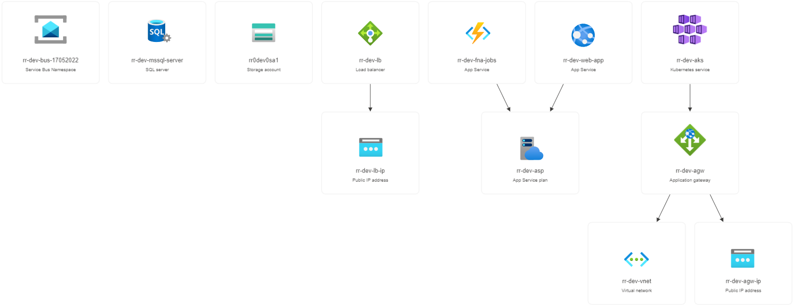
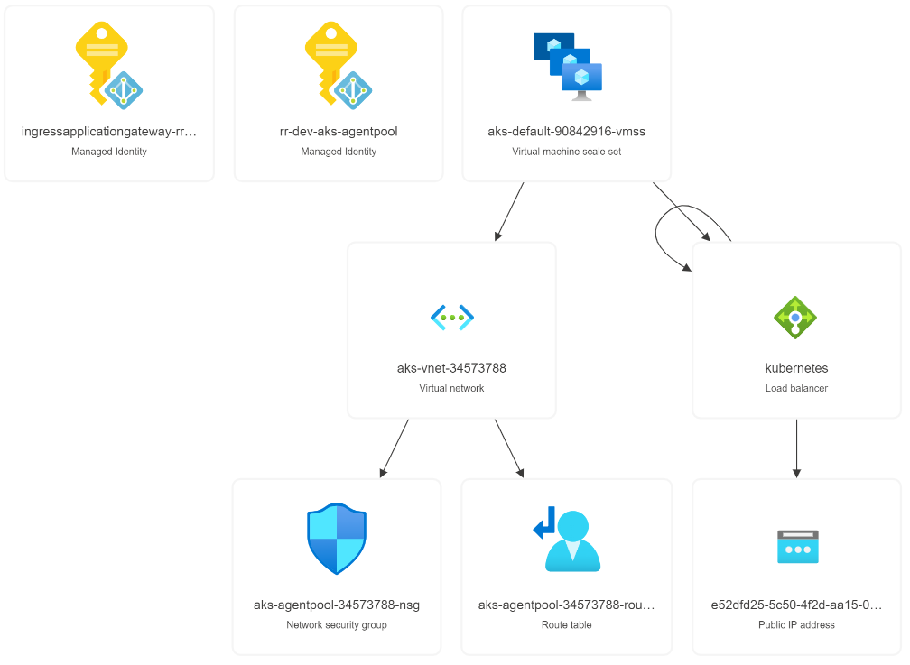
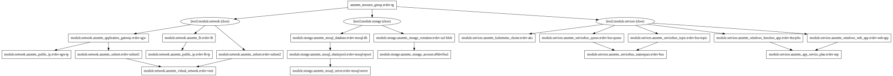
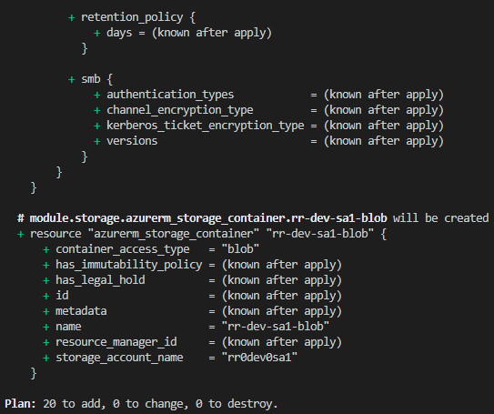
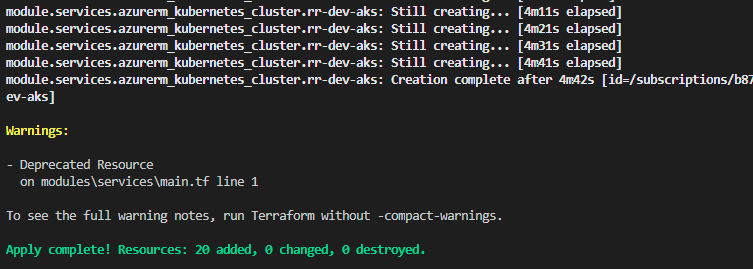

# Proof of Concept: Infrastructure as Code

This project contains the code for a *proof of concept* solution for managing and deploying cloud infrastructure with HashiCorp Terraform.

Writing setups as code brings a plethora of benefits with it, such as variables, modules, version control, managing multiple development environments and much more.

This code is oriented around the *development* environment, but can be adapted to support as many as prefered.

  
*A GIF of Terraform applying the infrastructure as code in this project*

## Structure
[root](./): The root directory  
- main.tf, the entry-point for initialisation and loading modules
- variables.tf, any external variables to be included as parameters
- terraform.tfvars, variable declaration (Should be kept secret)

[docs](./docs): Documentation  
- graph.svg, rendered SVG generated by graph.txt
- graph.txt, the output of `terraform graph`
- terraformplan, the binary output of `terraform plan`
- terraformplan.json, the binary output converted to readable JSON format

[modules](./modules): A subdirectory of modules to use.
- [network](./modules/network):
  - main.tf, entrypoint for the module
  - outputs.tf, any resources we wish to export for use in other modules
  - variables.tf, any variables to be included as parameters in the module

- [services](./modules/services):
  - main.tf
  - outputs.tf
  - variables.tf

- [storage](./modules/storage):
  - main.tf
  - outputs.tf
  - variables.tf

## Results
The code in this project allows us to deploy 26 resources on the Microsoft Azure Cloud Platform, including network, storage, a Kubernetes cluster and several services, in less than 10 minutes. At the same time, we can use features of Terraform to plan, document, replace and destroy the same resource setups.

  
*The above image shows a collection of the resources deployed on Azure.*  

  
*The above image shows the resources in the Kubernetes cluster in a secondary resource group.*

### Planned execution
Terraform allows the developer to plan their execution with `terraform plan`, of which the output can be seen in [docs/terraformplan.json](./docs/terraformplan.json). This ensures the developer performs the exact infrastructure changes they expect.

### Dependency Graph
The dependency graph and references between resources creates a self-documenting infrastructure setup. A rendered SVG of the graph created in DOT format can be found in [docs/graph.svg](docs/graph.svg) and seen here:  
  
_A full screen SVG can be found in the RAW file here: https://raw.githubusercontent.com/Hold-Krykke-BA/Bachelor-Project/main/iac/docs/graph.svg_

### Deploying infrastructure
Using `terraform apply`, new infrastructure can be added or changes and replacements can be made to existing resources.

  

Which leads to the following result:  

  

### Destroying infrastructure
Resources managed by Terraform can be torn down with `terraform destroy`.

### Verifying code
Terraform allows code formatting according to specification with the `terraform fmt` command and code validation with the `terraform validation` command.

Terraform has built-in validation when applying code - to a certain degree. It will check for spelling and errors, and may catch invalid resource configuration before execution. Additionally it will also validate during execution against the Cloud Provider's API (In this case Azure), and return any errors it experiences.

Finally, third party linters can provide static analysis, ensuring the use of common standards and that typical errors will not occur. In this project we have added [tflint](https://github.com/terraform-linters/tflint) and extended it with the Azure ruleset, as can be seen in the configuration file [.tflint.hcl](./.tflint.hcl).

## What's next?
Terraform should not exist entirely on its own, as it is built for managing infrastructure, but not for managing the software on the infrastructure.
Often, Terraform is included as a part of a Continuous Integration/Continuous Delivery pipeline, as to manage the infrastructure, before the pipeline then deploys software onto it.

An example can be found here: https://learn.hashicorp.com/tutorials/terraform/automate-terraform  

Furthermore, the variables in [terraform.tfvars](./terraform.tfvars) should be kept secret and some of the resources should be further tweaked, such as for automatic scaling, once the full scale of the system is known.

Terraform have several advanced features, such as life cycles and data sources, that can be beneficial when using Terraform in production.

For large setups, it can be beneficial to write "generic", reusable modules that can allow for large amounts of similar resources to be generated by lists of variables using features of Terraform such as for-loops, functions and aggregations.